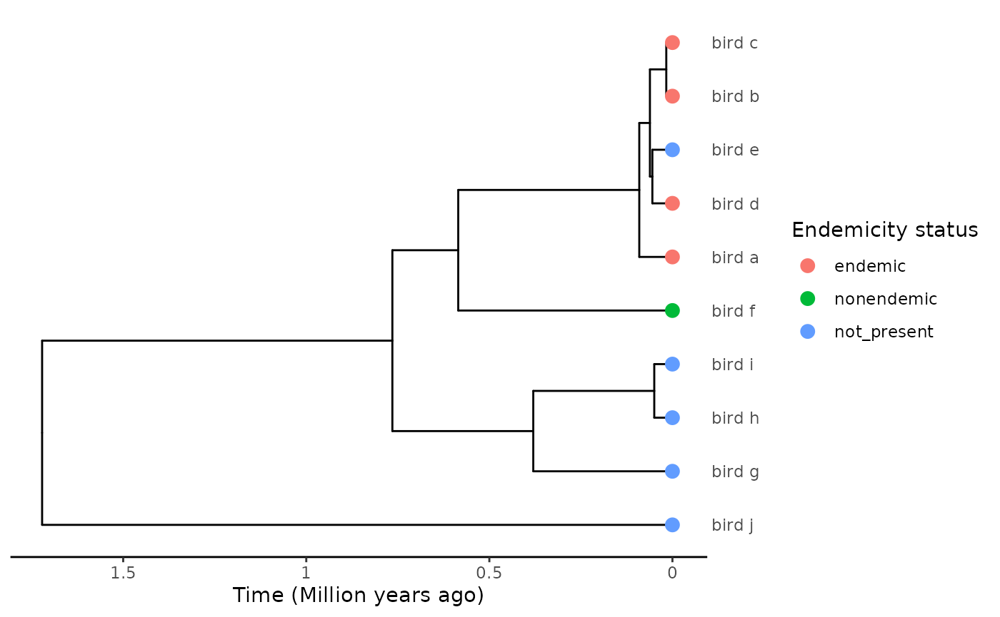
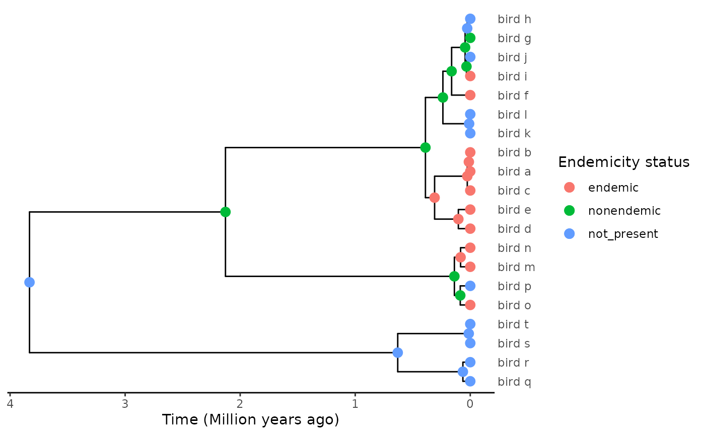
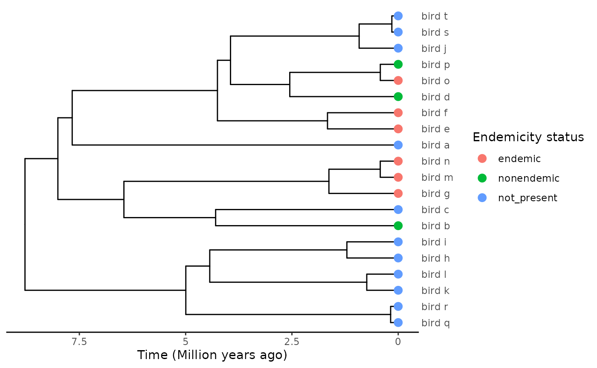
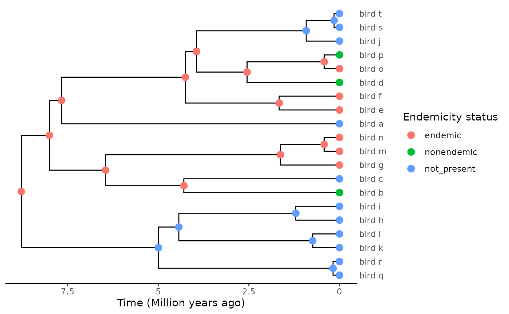
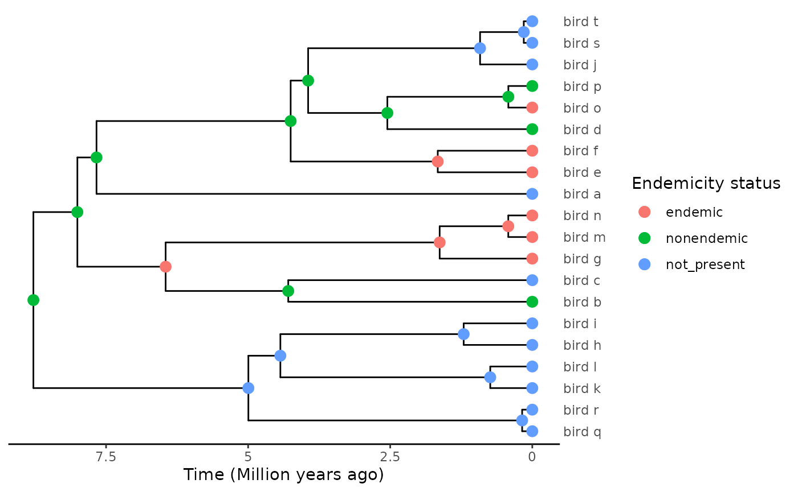
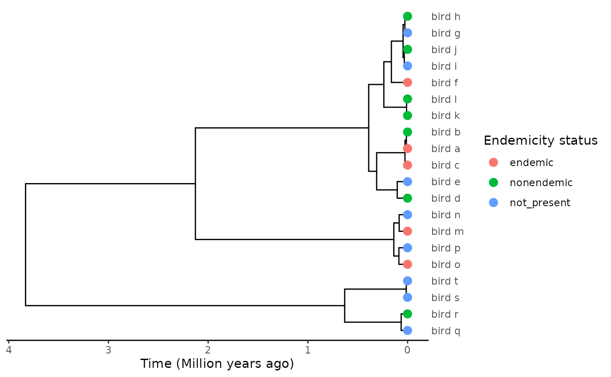
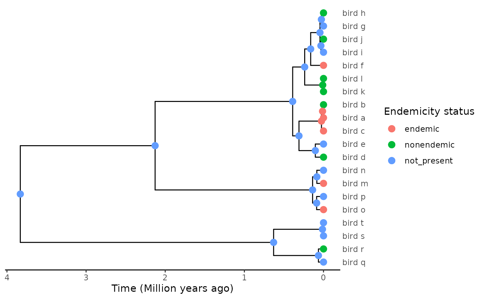

# Extending DAISIEprep ASR models

``` r

library(DAISIEprep)
```

## Introduction

In this tutorial we demonstrate how users can perform ancestral state
reconstruction using the functions implemented in `DAISIEprep`, or,
alternatively, by importing ancestral range reconstructions obtained
using methods from other packages.

## Using `DAISIEprep`’s `min` and `asr` algorithms

The core feature of `DAISIEprep` is the function
[`extract_island_species()`](https://joshwlambert.github.io/DAISIEprep/reference/extract_island_species.md),
which allows one to extract the island data expected as input by
`DAISIE`’s functions from a phylogeny with data regarding presence /
absence of each present-day species from the island. The function
automatically delineates and extracts clades formed by island species
within a complete mainland + island phylogeny, and attempt to estimate
the age of colonisation for each of these clades.

The default option of the function is the `min` algorithm, which
performs the data extraction in a manner consistent with DAISIE’s
assumptions. However, there may be cases where it is not desirable to
use this algorithm, particularly if some of DAISIE’s assumptions are at
odds with the clade at hand. For example, consider the following tree:



We have an island clade, comprising species a-f, except for species e
which is absent from the island. A parsimonious explanation for this
distribution would be a unique colonisation event before the split
between the f and a-e lineages, with the island population of species f
not diverging from its mainland ancestor, and species e jumping back to
the continent. This would result in a single island clade with a unique
colonisation time. Yet if we run `extract_island_species` through this
phylogeny:

``` r

extract_island_species(phylod, extraction_method = "min")
#> Class:  Island_tbl 
#>   clade_name     status missing_species   col_time col_max_age branching_times
#> 1     bird_a    endemic               0 0.09053720       FALSE              NA
#> 2     bird_b    endemic               0 0.06146596       FALSE    0.016781....
#> 3     bird_d    endemic               0 0.05480904       FALSE              NA
#> 4     bird_f nonendemic               0 0.58496106       FALSE              NA
#>   min_age      species clade_type
#> 1      NA       bird_a          1
#> 2      NA bird_b, ....          1
#> 3      NA       bird_d          1
#> 4      NA       bird_f          1
```

The algorithm estimates four independent colonisation events. This is
because the `min` algorithm assumes no back-colonisation (from island to
mainland), such that the presence of mainland-only species e inside the
island-only clade can only be accommodated by the lineage staying on the
mainland until the present, with at least three colonisation events
leading to species a-d. DAISIE would also not consider a colonisation
time before the (a-e)-f split, as any cladogenetic event taking place on
the island is assumed to lead to strictly endemic lineages (Valente et
al. 2015), while lineage f maintains a population on the mainland.

For such cases where the phylogeny is at odds with the process
considered by DAISIE, one may wish to resort to other trait evolution /
biogeography model to estimate when and how many times the island was
colonised. This requires performing ancestral state reconstruction, to
estimate the endemicity status of each internal node in the phylogeny.
`extract_island_species` offers the means to extract island data from a
phylogeny with completed node data, setting argument
`extraction_method = "asr"`.

The methods that `DAISIEprep` provides to run ancestral state
reconstruction (ASR) are parsimony and the Markov model (Mk) using
functionality from the R package `castor` (Louca and Doebeli 2018).
These are provided as standard in the
[`DAISIEprep::add_asr_node_states()`](https://joshwlambert.github.io/DAISIEprep/reference/add_asr_node_states.md)
function to easily allow a user to run a quick reconstruction of the
internal nodes’ endemicity status. The parsimony and the Mk model
provide simple models that have been widely used in evolutionary biology
since their development. For details on the parsimony method see
documentation for
[`castor::asr_max_parsimony()`](https://rdrr.io/pkg/castor/man/asr_max_parsimony.html)
and for details on the Mk model see documentation for
[`castor::asr_mk_model()`](https://rdrr.io/pkg/castor/man/asr_mk_model.html).

Here we show the same example as in the Tutorial vignette to show how
both methods are implemented:

``` r

set.seed(
  1,
  kind = "Mersenne-Twister",
  normal.kind = "Inversion",
  sample.kind = "Rejection"
)
phylo <- ape::rcoal(10)

phylo$tip.label <- c("bird_a", "bird_b", "bird_c", "bird_d", "bird_e", "bird_f",
                     "bird_g", "bird_h", "bird_i", "bird_j")

phylo <- phylobase::phylo4(phylo)

endemicity_status <- sample(
  x = c("not_present", "endemic", "nonendemic"), 
  size = length(phylobase::tipLabels(phylo)), 
  replace = TRUE,
  prob = c(0.6, 0.2, 0.2)
)

phylod <- phylobase::phylo4d(phylo, as.data.frame(endemicity_status))

# reconstruction using parsimony
phylod_parsimony <- add_asr_node_states(
  phylod = phylod, 
  asr_method = "parsimony")

# reconstruction using Mk model
phylod_parsimony <- add_asr_node_states(
  phylod = phylod, 
  asr_method = "mk"
)
#> Warning in add_asr_node_states(phylod = phylod, asr_method = "mk"): Mk asr
#> method selected but rate model not supplied assuming equal-rates (ER)
```

For details on the internal workings of the
[`add_asr_node_states()`](https://joshwlambert.github.io/DAISIEprep/reference/add_asr_node_states.md)
function see appendix at the bottom of this article.

## Using ancestral state reconstruction methods from other packages

The `min` and `asr` algorithms are implemented in `DAISIEprep`. However,
there are many models developed for the reconstruction of states
(traits) on a phylogenetic tree available in other R packages, and it
may be more appropriate to use a different type of model for the
empirical group being studied. Just as R is developed to allow for
packages to [extend the
language](https://cran.r-project.org/doc/manuals/r-release/R-exts.html),
`DAISIEprep` is designed to allow each extension of ASR methods for
incorporation with key functions
(e.g. [`extract_island_species()`](https://joshwlambert.github.io/DAISIEprep/reference/extract_island_species.md)).

Here we give examples of three packages that can be used an extensions:
`diversitree`, `BioGeoBEARS` and `corHMM`.

`diversitree` (FitzJohn 2012) is a package containing a suite of State
Speciation and Extinction (SSE) model which can reconstruct ancestral
states under a model in which the rates of speciation, extinction and
transition between states all influence the reconstruction. These models
prevent the bias of having many species in a state because of high
speciation but a model, such as the Mk model, assumes it is due to high
transition rates into that state (see Maddison and Knowles (2006)). The
example we give uses the MuSSE model with a three states (island
endemic, island non-endemic and not present on the island), and the
GeoSSE model that considers presence or absence from two geographic
areas (island and mainland). Other SSE models in `diversitree` can be
applied in the same manner.

`BioGeoBEARS` (Matzke 2013) is a widely used package that includes the
DEC and DEC+J models of biogeographic reconstruction. Therefore, it may
be that people familiar with these models want to apply them for
extracting island colonisations for DAISIE.

Lastly, `corHMM` (Beaulieu et al. 2013) is a package that implements a
hidden markov model of evolution, similar to the Mk model, but can
better account for rate heterogeneity by introducing hidden states into
the model. Each model can be argued for or against; with the choice
influenced by the taxonomic group being studied.

## DEC+J

We consider the following randomly generated phylogeny and tip data:

As a first example, we consider the popular DEC
(Dispersal-Extinction-Cladogenesis) model (Ree and Smith 2008) with
founder-event speciation (DEC+J, Matzke (2013)), implemented in R in the
**biogeobears** package (Matzke 2013).

``` r

require(BioGeoBEARS)
#> Loading required package: BioGeoBEARS
require(ape) # BioGeoBEARS does not load ape::has.singles() which it calls
#> Loading required package: ape
```

BioGeoBEARS revolves around an object, `BioGeoBEARS_run`, which stores
input data, the structure of the model to optimise, and control
parameters for optimisation.

``` r

# Default structure of the BioGeoBEARS object
bgb_run <- BioGeoBEARS::define_BioGeoBEARS_run()
bgb_run
#> $geogfn
#> [1] "/home/runner/work/_temp/Library/BioGeoBEARS/extdata/Psychotria_geog.data"
#> 
#> $trfn
#> [1] "/home/runner/work/_temp/Library/BioGeoBEARS/extdata/Psychotria_5.2.newick"
#> 
#> $abbr
#> [1] "default"
#> 
#> $description
#> [1] "defaults"
#> 
#> $BioGeoBEARS_model_object
#> An object of class "BioGeoBEARS_model"
#> Slot "params_table":
#>          type    init      min      max     est                note
#> d        free 0.01000  1.0e-12  5.00000 0.01000               works
#> e        free 0.01000  1.0e-12  5.00000 0.01000               works
#> a       fixed 0.00000  1.0e-12  5.00000 0.00000               works
#> b       fixed 1.00000  1.0e-12  1.00000 1.00000 non-stratified only
#> x       fixed 0.00000 -2.5e+00  2.50000 0.00000               works
#> n       fixed 0.00000 -1.0e+01 10.00000 0.00000               works
#> w       fixed 1.00000 -1.0e+01 10.00000 1.00000               works
#> u       fixed 0.00000 -1.0e+01 10.00000 0.00000               works
#> j       fixed 0.00000  1.0e-05  2.99999 0.00000               works
#> ysv       3-j 2.99999  1.0e-05  3.00000 2.99999               works
#> ys    ysv*2/3 1.99999  1.0e-05  2.00000 1.99999               works
#> y     ysv*1/3 1.00000  1.0e-05  1.00000 1.00000               works
#> s     ysv*1/3 1.00000  1.0e-05  1.00000 1.00000               works
#> v     ysv*1/3 1.00000  1.0e-05  1.00000 1.00000               works
#> mx01    fixed 0.00010  1.0e-04  0.99990 0.00010               works
#> mx01j    mx01 0.00010  1.0e-04  0.99990 0.00010               works
#> mx01y    mx01 0.00010  1.0e-04  0.99990 0.00010               works
#> mx01s    mx01 0.00010  1.0e-04  0.99990 0.00010               works
#> mx01v    mx01 0.00010  1.0e-04  0.99990 0.00010               works
#> mx01r   fixed 0.50000  1.0e-04  0.99990 0.50000                  no
#> mf      fixed 0.10000  5.0e-03  0.99500 0.10000                 yes
#> dp      fixed 1.00000  5.0e-03  0.99500 1.00000                 yes
#> fdp     fixed 0.00000  5.0e-03  0.99500 0.00000                 yes
#>                                                                        desc
#> d                         anagenesis: rate of 'dispersal' (range expansion)
#> e                      anagenesis: rate of 'extinction' (range contraction)
#> a           anagenesis: rate of range-switching (i.e. for a standard char.)
#> b                                    anagenesis: exponent on branch lengths
#> x                                   exponent on distance (modifies d, j, a)
#> n                     exponent on environmental distance (modifies d, j, a)
#> w               exponent on manual dispersal multipliers (modifies d, j, a)
#> u            anagenesis: exponent on extinction risk with area (modifies e)
#> j                 cladogenesis: relative per-event weight of jump dispersal
#> ysv                                                     cladogenesis: y+s+v
#> ys                                                        cladogenesis: y+s
#> y       cladogenesis: relative per-event weight of sympatry (range-copying)
#> s              cladogenesis: relative per-event weight of subset speciation
#> v           cladogenesis: relative per-event weight of vicariant speciation
#> mx01                  cladogenesis: controls range size of smaller daughter
#> mx01j                 cladogenesis: controls range size of smaller daughter
#> mx01y                 cladogenesis: controls range size of smaller daughter
#> mx01s                 cladogenesis: controls range size of smaller daughter
#> mx01v                 cladogenesis: controls range size of smaller daughter
#> mx01r                       root: controls range size probabilities of root
#> mf                         mean frequency of truly sampling OTU of interest
#> dp                 detection probability per true sample of OTU of interest
#> fdp   false detection of OTU probability per true taphonomic control sample
#> 
#> 
#> $timesfn
#> [1] NA
#> 
#> $distsfn
#> [1] NA
#> 
#> $dispersal_multipliers_fn
#> [1] NA
#> 
#> $area_of_areas_fn
#> [1] NA
#> 
#> $areas_allowed_fn
#> [1] NA
#> 
#> $areas_adjacency_fn
#> [1] NA
#> 
#> $detects_fn
#> [1] NA
#> 
#> $controls_fn
#> [1] NA
#> 
#> $max_range_size
#> [1] NA
#> 
#> $force_sparse
#> [1] FALSE
#> 
#> $use_detection_model
#> [1] FALSE
#> 
#> $print_optim
#> [1] TRUE
#> 
#> $printlevel
#> [1] 0
#> 
#> $on_NaN_error
#> [1] -1e+50
#> 
#> $wd
#> [1] "/home/runner/work/DAISIEprep/DAISIEprep/vignettes/articles"
#> 
#> $num_cores_to_use
#> [1] NA
#> 
#> $cluster_already_open
#> [1] FALSE
#> 
#> $use_optimx
#> [1] TRUE
#> 
#> $rescale_params
#> [1] FALSE
#> 
#> $return_condlikes_table
#> [1] FALSE
#> 
#> $calc_TTL_loglike_from_condlikes_table
#> [1] TRUE
#> 
#> $calc_ancprobs
#> [1] TRUE
#> 
#> $speedup
#> [1] TRUE
#> 
#> $include_null_range
#> [1] TRUE
#> 
#> $useAmbiguities
#> [1] FALSE
#> 
#> $min_branchlength
#> [1] 1e-06
```

Many elements of this list are only relevant for advanced options of the
model and can be ignored if these features are not used. For example,
BioGeoBEARS allows explicit modelling of the connectivity between areas
and time-dependent availability of the areas. In this example, we focus
on a simple dispersal scenario between two areas (mainland and island),
so these elements can be ignored. We direct the interested user to the
[relevant tutorial](http://phylo.wikidot.com/biogeobears#toc17) on the
BioGeoBEARS website.

BioGeoBEARS expects at least two inputs, the phylogeny and the
biogeographic data, a matrix of tip states. Both must be supplied as
paths to files which will be read when the model is run.

The tree can be supplied in Newick or Nexus format, as a text file.

``` r

path_to_phylo <- system.file("extending_asr", "biogeobears_ex_phylo.txt", package = "DAISIEprep")
phylo <- as(phylod, "phylo")
#> Warning in asMethod(object): losing data while coercing phylo4d to phylo
ape::write.tree(phylo, file = path_to_phylo)

bgb_run$trfn <- path_to_phylo
```

Tip data must be supplied as a text file specifying presence/absence of
every tip in each area, in the format used by the
[PHYLIP](https://evolution.genetics.washington.edu/phylip.html) sofware
suite. We report the full specifications from the
[BioGeoBEARS](http://phylo.wikidot.com/biogeobears#script) tutorial

    #######################################################
    # Geography file
    # Notes:
    # 1. This is a PHYLIP-formatted file. This means that in the 
    #    first line, 
    #    - the 1st number equals the number of rows (species)
    #    - the 2nd number equals the number of columns (number of areas)
    #    - after a tab, put the areas in parentheses, with spaces: (A B C D)
    #
    # 1.5. Example first line:
    #    10    4    (A B C D)
    # 
    # 2. The second line, and subsequent lines:
    #    speciesA    0110
    #    speciesB    0111
    #    speciesC    0001
    #         ...
    # 
    # 2.5a. This means a TAB between the species name and the area 0/1s
    # 2.5b. This also means NO SPACE AND NO TAB between the area 0/1s.
    # 
    # 3. See example files at:
    #    http://phylo.wikidot.com/biogeobears#files
    # 
    # 4. Make you understand what a PLAIN-TEXT EDITOR is:
    #    http://phylo.wikidot.com/biogeobears#texteditors
    #
    # 3. The PHYLIP format is the same format used for C++ LAGRANGE geography files.
    #
    # 4. All names in the geography file must match names in the phylogeny file.
    #
    # 5. DON'T USE SPACES IN SPECIES NAMES, USE E.G. "_"
    #
    # 6. Operational taxonomic units (OTUs) should ideally be phylogenetic lineages, 
    #    i.e. genetically isolated populations.  These may or may not be identical 
    #    with species.  You would NOT want to just use specimens, as each specimen 
    #    automatically can only live in 1 area, which will typically favor DEC+J 
    #    models.  This is fine if the species/lineages really do live in single areas,
    #    but you wouldn't want to assume this without thinking about it at least. 
    #    In summary, you should collapse multiple specimens into species/lineages if 
    #    data indicates they are the same genetic population.
    ######################################################

For convenience, we have included a function that writes this file from
a `phylod` object for the simple mainland-island case.

``` r

path_to_biogeo <- system.file("extending_asr", "biogeobears_ex_phylo.txt", package = "DAISIEprep")
write_phylip_biogeo_file(phylod, path_to_biogeo)
BioGeoBEARS::getranges_from_LagrangePHYLIP(path_to_biogeo)
#> An object of class "tipranges"
#> numeric(0)
#> Slot "df":
#>        M I
#> bird_a 0 1
#> bird_b 0 1
#> bird_c 0 1
#> bird_d 0 1
#> bird_e 0 1
#> bird_f 0 1
#> bird_g 1 1
#> bird_h 1 0
#> bird_i 0 1
#> bird_j 1 0
#> bird_k 1 0
#> bird_l 1 0
#> bird_m 0 1
#> bird_n 0 1
#> bird_o 0 1
#> bird_p 1 0
#> bird_q 1 0
#> bird_r 1 0
#> bird_s 1 0
#> bird_t 1 0
bgb_run$geogfn <- path_to_biogeo
```

While we were at it, we have nested this function in
[`write_biogeobears_input()`](https://joshwlambert.github.io/DAISIEprep/reference/write_biogeobears_input.md),
to prepare both this file and the Newick file above in one command

``` r

path_to_phylo <- system.file("extending_asr", "biogeobears_ex_phylo.txt", package = "DAISIEprep")
path_to_biogeo <- system.file("extending_asr", "biogeobears_ex_biogeo.txt", package = "DAISIEprep")
write_biogeobears_input(phylod, path_to_phylo, path_to_biogeo)
#> Warning in asMethod(object): losing data while coercing phylo4d to phylo

bgb_run$trfn <- path_to_phylo
bgb_run$geogfn <- path_to_biogeo
```

The structure of the model is contained in `BioGeoBEARS_model_object`.
This is simply a table that contains the status (fixed or free), values
(initial, min/max boundaries and estimated value if free) and
documentation of each parameter of the supermodel.

``` r

bgb_run$BioGeoBEARS_model_object
#> An object of class "BioGeoBEARS_model"
#> Slot "params_table":
#>          type    init      min      max     est                note
#> d        free 0.01000  1.0e-12  5.00000 0.01000               works
#> e        free 0.01000  1.0e-12  5.00000 0.01000               works
#> a       fixed 0.00000  1.0e-12  5.00000 0.00000               works
#> b       fixed 1.00000  1.0e-12  1.00000 1.00000 non-stratified only
#> x       fixed 0.00000 -2.5e+00  2.50000 0.00000               works
#> n       fixed 0.00000 -1.0e+01 10.00000 0.00000               works
#> w       fixed 1.00000 -1.0e+01 10.00000 1.00000               works
#> u       fixed 0.00000 -1.0e+01 10.00000 0.00000               works
#> j       fixed 0.00000  1.0e-05  2.99999 0.00000               works
#> ysv       3-j 2.99999  1.0e-05  3.00000 2.99999               works
#> ys    ysv*2/3 1.99999  1.0e-05  2.00000 1.99999               works
#> y     ysv*1/3 1.00000  1.0e-05  1.00000 1.00000               works
#> s     ysv*1/3 1.00000  1.0e-05  1.00000 1.00000               works
#> v     ysv*1/3 1.00000  1.0e-05  1.00000 1.00000               works
#> mx01    fixed 0.00010  1.0e-04  0.99990 0.00010               works
#> mx01j    mx01 0.00010  1.0e-04  0.99990 0.00010               works
#> mx01y    mx01 0.00010  1.0e-04  0.99990 0.00010               works
#> mx01s    mx01 0.00010  1.0e-04  0.99990 0.00010               works
#> mx01v    mx01 0.00010  1.0e-04  0.99990 0.00010               works
#> mx01r   fixed 0.50000  1.0e-04  0.99990 0.50000                  no
#> mf      fixed 0.10000  5.0e-03  0.99500 0.10000                 yes
#> dp      fixed 1.00000  5.0e-03  0.99500 1.00000                 yes
#> fdp     fixed 0.00000  5.0e-03  0.99500 0.00000                 yes
#>                                                                        desc
#> d                         anagenesis: rate of 'dispersal' (range expansion)
#> e                      anagenesis: rate of 'extinction' (range contraction)
#> a           anagenesis: rate of range-switching (i.e. for a standard char.)
#> b                                    anagenesis: exponent on branch lengths
#> x                                   exponent on distance (modifies d, j, a)
#> n                     exponent on environmental distance (modifies d, j, a)
#> w               exponent on manual dispersal multipliers (modifies d, j, a)
#> u            anagenesis: exponent on extinction risk with area (modifies e)
#> j                 cladogenesis: relative per-event weight of jump dispersal
#> ysv                                                     cladogenesis: y+s+v
#> ys                                                        cladogenesis: y+s
#> y       cladogenesis: relative per-event weight of sympatry (range-copying)
#> s              cladogenesis: relative per-event weight of subset speciation
#> v           cladogenesis: relative per-event weight of vicariant speciation
#> mx01                  cladogenesis: controls range size of smaller daughter
#> mx01j                 cladogenesis: controls range size of smaller daughter
#> mx01y                 cladogenesis: controls range size of smaller daughter
#> mx01s                 cladogenesis: controls range size of smaller daughter
#> mx01v                 cladogenesis: controls range size of smaller daughter
#> mx01r                       root: controls range size probabilities of root
#> mf                         mean frequency of truly sampling OTU of interest
#> dp                 detection probability per true sample of OTU of interest
#> fdp   false detection of OTU probability per true taphonomic control sample
```

BioGeoBEARS is indeed built as a supermodel which parameters can be
turned on or off to reproduce biogeographic models like DEC, DIVA,
BayArea and/or expand them.

See Fig. 1 in Matzke (2013) for an overview of the supermodel and
parameters:

``` r

knitr::include_graphics("http://phylo.wdfiles.com/local--files/biogeobears/BioGeoBEARS_supermodel.png")
```


Note that by default, all parameters but *d* and *e* are turned off
(i.e., fixed and set to a value such that they cause no effect). That
is, by default, `BioGeoBEARS_model_object` specifies the DEC model.

For this example, we simply modify the model to make *j* a free
parameter, and thus turn the model into DEC+J.

``` r

# DEC -> DEC+J
bgb_run$BioGeoBEARS_model_object@params_table$desc[9] <- "free"
bgb_run$BioGeoBEARS_model_object@params_table$init[9] <- 0.01 # same value as d, e
```

Some further controls:

``` r

bgb_run$num_cores_to_use <- 1 # no default value on this one
bgb_run$print_optim <- FALSE # for the sake of the vignette
```

Once everything is set up, it’s a good idea to check that the input
complies to the format expected by BioGeoBEARS with the provided
function. Then, we’re ready to run the optimisation:

``` r

BioGeoBEARS::check_BioGeoBEARS_run(bgb_run)
#> [1] TRUE
res <- BioGeoBEARS::bears_optim_run(bgb_run)
#> [1] "Note: tipranges_to_tip_condlikes_of_data_on_each_state() is converting a states_list with (0-based) numbers to the equivalent areanames"
#> 
#> Your computer has 4 cores.
#> [1] "parscale:"
#> [1] 1 1
#> 
#> 
#> NOTE: Before running optimx(), here is a test calculation of the data likelihood
#> using calc_loglike_for_optim() on initial parameter values, with printlevel=2...
#> if this crashes, the error messages are more helpful
#> than those from inside optimx().
#> 
#> 
#> calc_loglike_for_optim() on initial parameters loglike=-26.4272
#> 
#> 
#> 
#> Calculation of likelihood on initial parameters: successful.
#> 
#> Now starting Maximum Likelihood (ML) parameter optimization with optimx()...
#> 
#> 
#> 
#> Printing any warnings() that occurred during calc_loglike_for_optim():
#> 
#> 
#> 
#> Results of optimx_scalecheck() below. Note: sometimes rescaling parameters may be helpful for ML searches, when the parameters have much different absolute sizes. This can be attempted by setting BioGeoBEARS_run_object$rescale_params = TRUE.
#> 
#> $lpratio
#> [1] 0
#> 
#> $lbratio
#> [1] 0
#> 
#> Maximizing -- use negfn and neggr
#> Warning in (function (npt = min(n + 2L, 2L * n), rhobeg = NA, rhoend = NA, :
#> unused control arguments ignored
#> 
#> 
#> This is the output from optim, optimx, or GenSA. Check the help on those functions to
#> interpret this output and check for convergence issues:
#> 
#>               p1           p2   value fevals gevals niter convcode  kkt1 kkt2
#> bobyqa 0.3984246 1.106577e-08 -19.384     65     NA    NA        0 FALSE TRUE
#>        xtime
#> bobyqa 0.422
```

We do get a warning, but
[apparently](http://phylo.wikidot.com/biogeobears-warnings-to-ignore-mostly#unused_control_arguments)
this can be ignored.

Marginal probabilities for the ancestral states appear to be found in
element `$ML_marginal_prob_each_state_at_branch_top_AT_node` of the
output (from what I infer from the code of the [plotting function
code](https://github.com/nmatzke/BioGeoBEARS/blob/7b16e5263e91389d8e16b7bead4437d39b8be5bc/R/BioGeoBEARS_plots_v1.R#L432)).
Columns respectively correspond to the posterior probability of the node
being present in the first area only (here, mainland, i.e. not present),
second area only (island, endemic), or both areas (widespread state,
nonendemic). Rows correspond to nodes (including tips!) and their order
is the same as in the tree object *read from the input Newick file*,
which may differ from the original tree. To identify the probability
associated to each node we need to match the rows with the corresponding
tip labels.

``` r

# Extract probabilities
asr_likelihoods <- res$ML_marginal_prob_each_state_at_branch_top_AT_node[,-1]
# Need to find which tip label matches each row
tree <- ape::read.tree(res$inputs$trfn)
tip_labels <- tree$tip.label
node_labels <- tree$node.label
if (is.null(node_labels)) node_labels <- rep(NA, length(tip_labels) - 1)
asr_df <- data.frame(
  labels = c(tip_labels, node_labels),
  not_present_prob = asr_likelihoods[,1],
  endemic_prob = asr_likelihoods[,2],
  nondendemic_prob = asr_likelihoods[,3]
)
head(asr_df)
#>   labels not_present_prob endemic_prob nondendemic_prob
#> 1 bird_d                0            1                0
#> 2 bird_e                0            1                0
#> 3 bird_c                0            1                0
#> 4 bird_a                0            1                0
#> 5 bird_b                0            1                0
#> 6 bird_f                0            1                0
tail(asr_df)
#>    labels not_present_prob endemic_prob nondendemic_prob
#> 34   <NA>     6.137318e-13 2.401258e-02     9.759874e-01
#> 35   <NA>     9.474826e-11 1.180088e-10     1.000000e+00
#> 36   <NA>     2.535833e-22 1.000000e+00     2.671022e-11
#> 37   <NA>     1.000000e+00 8.344796e-19     1.776066e-08
#> 38   <NA>     1.000000e+00 8.802463e-23     4.458255e-10
#> 39   <NA>     1.000000e+00 1.529832e-25     9.339950e-11
```

The code above has been wrapped in a utility function,
[`extract_biogeobears_ancestral_states_probs()`](https://joshwlambert.github.io/DAISIEprep/reference/extract_biogeobears_ancestral_states_probs.md).

``` r

asr_df <- extract_biogeobears_ancestral_states_probs(res)
```

The last step before extracting the island community from the tree is to
rule which state each node is in from the probabilities. We provide a
convenient function to do this from the output of the previous function:

``` r

endemicity_status <- select_endemicity_status(asr_df, method = "max")
```

By default, (`method = "max"`), we simply select the state with the
highest probability (preferring the last in the event of a tie).
`method` can also be set to `"random"` to sample states randomly based
on the probabilities, which can be of use if one desires to explore the
sensibility of downstream DAISIE analyses to the ancestral state
reconstruction.

Finally, we recreate the data format expected by
[`extract_island_species()`](https://joshwlambert.github.io/DAISIEprep/reference/extract_island_species.md)
(one state column `endemicity_status` for tips, one state column
`island_status` for internal nodes) and add it back to the tree data
with `phylobase`’s `phylo4d` class.

``` r

# Add endemicity data
nb_tips <- ape::Ntip(tree)
asr_df$label <- NULL # drop label
asr_df$endemicity_status <- rep(NA, nrow(asr_df))
asr_df$endemicity_status[1:nb_tips] <- endemicity_status[1:nb_tips] 
asr_df$island_status <- rep(NA, nrow(asr_df))
asr_df$island_status[(nb_tips + 1):nrow(asr_df)] <- endemicity_status[(nb_tips + 1):nrow(asr_df)] 

# Rebuild phylod with ancestral states
phylod <- phylobase::phylo4d(tree, all.data = asr_df)
plot_phylod(phylod)
```



Voilà!

``` r

island_clades <- DAISIEprep::extract_island_species(
  phylod = phylod,
  extraction_method = "asr"
)
island_clades@island_tbl$species
#> [[1]]
#>  [1] "bird_d" "bird_e" "bird_c" "bird_a" "bird_b" "bird_f" "bird_i" "bird_g"
#>  [9] "bird_o" "bird_m" "bird_n"
island_clades@island_tbl$branching_times
#> [[1]]
#>  [1] 2.12780098 0.38960848 0.30994875 0.16207082 0.13800731 0.10346994
#>  [7] 0.08406573 0.04477260 0.02586891 0.01218459
```

## MuSSE

SSE-class models explicitly model the inter-dependency between the
evolution of a set of traits and evolutionary rates (speciation and
extinction). When traits are set to represent geographic areas, such
models can be used to model range evolution. For a mainland-island
system, we could model the endemicity status as a ternary trait:
endemic, non-endemic, or not present on the island.

Discrete-trait models with more than two states are modelled with MuSSE
(FitzJohn 2012), which is implemented in package `diversitree`.

To make the example straightforward and avoid non-convergence issues, we
use a tree simulated directly with MuSSE as an example, with three
states (mainland/island/both, or not present/endemic/nonendemic) and
arbitrary parameter values:

``` r

# Simulate a tree under a MuSSE model,
# with arbitrary initial parameter values
pars <- c(
  # lambda1 lambda2 lambda3
  0.2, 0.2, 0.2,
  # mu1 mu2 mu3
  0.02, 0.02, 0.02,
  # q12 q13 q21 q23 q31 q32
  0,  0.1,  0, 0,  0.1, 0.1
)
set.seed(4)
phylo <- diversitree::trees(
  pars,
  type = "musse",
  max.taxa = 20,
  max.t = Inf,
  x0 = 1
)[[1]]

# DAISIEprep requires binomial names
ntips <- ape::Ntip(phylo)
bird_names <- paste0("bird_", letters[1:ntips])
phylo$tip.label <- bird_names
names(phylo$tip.state) <- bird_names

# DAISIEprep requires a mainland outgroup
outgroup_clade <- c("bird_h", "bird_i", "bird_l", "bird_k", "bird_r", "bird_q")
phylo$tip.state[phylo$tip.label %in% outgroup_clade] <- 1 # not_present
```

The output phylogenetic trees come with simulated states attached at the
tips:

``` r

phylo$tip.state
#> bird_a bird_b bird_c bird_d bird_e bird_f bird_g bird_h bird_i bird_j bird_k 
#>      1      3      1      3      2      2      2      1      1      1      1 
#> bird_l bird_m bird_n bird_o bird_p bird_q bird_r bird_s bird_t 
#>      1      2      2      2      3      1      1      1      1
```

Because we’re going to switch back and forth between those single-digit
states and the three endemicity status used by `DAISIEprep`, we have
included functions to switch easily between the two:

``` r

endemicity_status <- sse_states_to_endemicity(phylo$tip.state, sse_model = "musse")
phylod <- phylobase::phylo4d(phylo, as.data.frame(endemicity_status))
plot_phylod(phylod)
```



ASR with `diversitree` is done in three steps. The model structure is
first specified to create a likelihood function; then parameters are
optimised for this function; and finally the probabilities of states of
the internal nodes are determined with the resulting maximum-likelihood
model.

``` r

states <- get_sse_tip_states(phylod, sse_model = "musse")
states # note that states must be named after tips
#> bird_a bird_b bird_c bird_d bird_e bird_f bird_g bird_h bird_i bird_j bird_k 
#>      1      3      1      3      2      2      2      1      1      1      1 
#> bird_l bird_m bird_n bird_o bird_p bird_q bird_r bird_s bird_t 
#>      1      2      2      2      3      1      1      1      1
tree <- as(phylod, "phylo")
#> Warning in asMethod(object): losing data while coercing phylo4d to phylo

# Create likelihood function
lik_musse <- diversitree::make.musse(
  tree = tree, 
  states = states, 
  k = 3
)
lik_musse
#> MuSSE likelihood function:
#>   * Parameter vector takes 12 elements:
#>      - lambda1, lambda2, lambda3, mu1, mu2, mu3, q12, q13, q21, q23,
#>        q31, q32
#>   * Function takes arguments (with defaults)
#>      - pars: Parameter vector
#>      - condition.surv [TRUE]: Condition likelihood on survial?
#>      - root [ROOT.OBS]: Type of root treatment
#>      - root.p [NULL]: Vector of root state probabilities
#>      - intermediates [FALSE]: Also return intermediate values?
#>   * Phylogeny with 20 tips and 19 nodes
#>      - Taxa: bird_a, bird_b, bird_c, bird_d, bird_e, bird_f, ...
#>   * Reference:
#>      - FitzJohn (submitted)
#> R definition:
#> function (pars, condition.surv = TRUE, root = ROOT.OBS, root.p = NULL, 
#>     intermediates = FALSE)
```

``` r

fit_musse <- diversitree::find.mle(func = lik_musse, x.init = pars, method = "subplex")

# MuSSE ancestral state reconstructions under the ML model
asr_musse <- diversitree::asr.marginal(lik = lik_musse, pars = coef(fit_musse))
asr_musse
#>              [,1]         [,2]         [,3]         [,4]         [,5]
#> [1,] 5.932021e-07 2.957938e-12 1.165003e-08 1.481783e-12 9.104286e-09
#> [2,] 9.999994e-01 1.000000e+00 1.000000e+00 1.000000e+00 1.000000e+00
#> [3,] 1.353886e-12 2.064840e-19 3.309455e-13 1.196563e-18 3.387157e-13
#>              [,6]         [,7]         [,8]         [,9]        [,10]
#> [1,] 6.385956e-14 3.264622e-15 9.975371e-01 9.999999e-01 1.680040e-13
#> [2,] 1.000000e+00 1.000000e+00 2.462789e-03 1.229092e-07 1.000000e+00
#> [3,] 1.233413e-12 2.464181e-12 1.389318e-07 5.994989e-11 2.837966e-18
#>             [,11]        [,12]        [,13]        [,14]        [,15]
#> [1,] 1.528827e-12 5.497805e-07 4.225137e-13 1.722711e-15 9.037885e-01
#> [2,] 1.000000e+00 9.999989e-01 1.000000e+00 1.000000e+00 9.621135e-02
#> [3,] 9.585585e-18 5.542938e-07 3.118874e-18 8.713015e-20 1.523346e-07
#>             [,16]        [,17]        [,18]        [,19]
#> [1,] 9.145696e-01 9.999139e-01 9.992928e-01 9.999998e-01
#> [2,] 8.543035e-02 8.610419e-05 7.071914e-04 2.130365e-07
#> [3,] 6.000565e-08 7.413017e-09 2.026303e-08 3.933283e-10
```

We obtain a (pivoted) table of probabilites linked to each state, from
which we can select states as for the BioGeoBEARS example:

``` r

asr_musse <- as.data.frame(t(asr_musse))
colnames(asr_musse) <- paste0(all_endemicity_status(), "_prob")

island_status <- select_endemicity_status(asr_musse, method = "max")
island_status
#>  [1] "endemic"     "endemic"     "endemic"     "endemic"     "endemic"    
#>  [6] "endemic"     "endemic"     "not_present" "not_present" "endemic"    
#> [11] "endemic"     "endemic"     "endemic"     "endemic"     "not_present"
#> [16] "not_present" "not_present" "not_present" "not_present"
asr_musse$island_status <- island_status
rownames(asr_musse) <- phylobase::nodeId(phylod, "internal")

phylod <- phylobase::addData(
  phylod,
  node.data = asr_musse
)
plot_phylod(phylod)
```



From this completed tree we can extract the island clade:

``` r

island_clades <- DAISIEprep::extract_island_species(
  phylod = phylod,
  extraction_method = "asr"
)
island_clades@island_tbl$species
#> [[1]]
#> [1] "bird_d" "bird_o" "bird_p" "bird_e" "bird_f" "bird_b" "bird_g" "bird_m"
#> [9] "bird_n"
island_clades@island_tbl$branching_times
#> [[1]]
#> [1] 8.0047889 6.4518206 4.2518993 2.5503507 1.6635537 1.6299262 0.4224813
#> [8] 0.4212151
```

SSE models in `diversitree` can be tuned further with constraints that
simplify the model. We can use this to make the model closer to the
assumptions of DAISIE. For example, it is not possible for a species to
jump directly to the island and disappear from the mainland
simultaneously; so that direct transitions from state 1 to 2 and back
should be forbidden. One could also assume mainland speciation to be
unlikely, resulting in zero speciation on the mainland and the same
speciation rate for endemic and nonendemic species:

``` r

lik_musse_c <- diversitree::constrain(
  lik_musse, 
  q12 ~ 0, q21 ~ 0, # no island-mainland jumps
  lambda1 ~ 0, lambda3 ~ lambda2 # no mainland speciation
)

# Parameters must be removed accordingly
pars_c <- c(
  # lambda2
  0.2,
  # mu1 mu2 mu3
  0.03, 0.03, 0.03,
  # q13 q23 q31 q32
  0, 0.02, 0, 0.01
)

fit_musse_c <- diversitree::find.mle(func = lik_musse_c, x.init = pars_c, method = "subplex")
# Won't work because of poor parameter choice vs tip states
```

The example above won’t succeed because of a mismatch between the
initial parameters value and the distribution of states at the tip, but
we include it for illustrating how one would implement constrains on a
`diversitree` model.

Instead of further constraining a multi-state model to emulate dispersal
and evolution between mainland and island, one may find more appropriate
to use an SSE model specifically dedicated to geographic traits, i.e.,
GeoSSE.

## GeoSSE

GeoSSE (Goldberg et al. 2011) is a special case of SSE models dedicated
to the case where traits correspond to presence or absence from two
geographic areas, which is the case for our mainland/island clade. Its
most important feature is that instead of considering the widespread
state (mainland + island, that is nonendemic) as a third separate
category from the two single-area states (as in the MuSSE example
above), GeoSSE explicitly models it as corresponding to presence in both
areas, just as in BioGeoBEARS. Accordingly, dispersal is unidirectional,
from a single area towards the widespread state. Extinction from an area
the widespread state returns the species to the remaining single area,
while the same extinction while already in a single area results in the
true extinction of the species.

In fact, GeoSSE is the SSE implementation of the DEC model, the only
difference being that GeoSSE assumes an effect of areas themselves on
the rates of speciation and extinction; and thus on the branching
patterns observed in the tree \[goldberg_phylogenetic_2011\], while DEC
only maps geography along the branches of the tree.

We use the same tree as the previous example:

``` r

# Rm all data but tip states
phylod@data <- phylod@data[1]
plot_phylod(phylod)
```


GeoSSE in `diversitree` has a different state encoding than MuSSE:
states are expected to be 0, 1, 2, with 0 corresponding to the
widespread state (that is, present on both mainland and island,
nonendemic) and the two other states corresponding to single geographic
areas. Hereafter, we follow 1 = mainland/not_present and 2 =
island/endemic.

The syntax is otherwise the same as for MuSSE (and other SSE models
implemented in `diversitree`).

``` r

states <- get_sse_tip_states(phylod, sse_model = "geosse")
states # note the encoding differs from the MuSSE example
#> bird_a bird_b bird_c bird_d bird_e bird_f bird_g bird_h bird_i bird_j bird_k 
#>      1      0      1      0      2      2      2      1      1      1      1 
#> bird_l bird_m bird_n bird_o bird_p bird_q bird_r bird_s bird_t 
#>      1      2      2      2      0      1      1      1      1

tree <- as(phylod, "phylo")

# Create likelihood function
lik_geosse <- diversitree::make.geosse(
  tree = tree, 
  states = states
)
lik_geosse
#> GeoSSE likelihood function:
#>   * Parameter vector takes 7 elements:
#>      - sA, sB, sAB, xA, xB, dA, dB
#>   * Function takes arguments (with defaults)
#>      - pars: Parameter vector
#>      - condition.surv [TRUE]: Condition likelihood on survial?
#>      - root [ROOT.OBS]: Type of root treatment
#>      - root.p [NULL]: Vector of root state probabilities
#>      - intermediates [FALSE]: Also return intermediate values?
#>   * Phylogeny with 20 tips and 19 nodes
#>      - Taxa: bird_a, bird_b, bird_c, bird_d, bird_e, bird_f, ...
#>   * Reference:
#>      - Goldberg et al. (2011) doi:10.1093/sysbio/syr046
#> R definition:
#> function (pars, condition.surv = TRUE, root = ROOT.OBS, root.p = NULL, 
#>     intermediates = FALSE)
```

``` r

# Initial GeoSSE parameter values
pars <- c(
  # Speciation: sA sB sAB
  0.2, 0.2, 0.2,
  # Extinction: xA xB
  0.02, 0.02,
  # Dispersal: dA dB
  0.1, 0
)

# Optimisation of the model's likelihood
fit_geosse <- diversitree::find.mle(func = lik_geosse, x.init = pars, method = "subplex")

# Ancestral state reconstructions under the ML model
asr_geosse <- diversitree::asr.marginal(lik = lik_geosse, pars = coef(fit_geosse))

# Select node states from marginal probabilities
asr_geosse <- as.data.frame(t(asr_geosse))
colnames(asr_geosse) <- c("nonendemic_prob", "not_present_prob", "endemic_prob") # make sure to get the order right!
island_status <- select_endemicity_status(asr_geosse, method = "max")

# Add node data to the tree
asr_geosse$island_status <- island_status
rownames(asr_geosse) <- phylobase::nodeId(phylod, "internal")
phylod <- phylobase::addData(
  phylod,
  node.data = asr_geosse
)
plot_phylod(phylod)
```



We are now ready to extract the island clade.

``` r

island_clades <- DAISIEprep::extract_island_species(
  phylod = phylod,
  extraction_method = "asr"
)
#> Warning in extract_species_asr(phylod = phylod, species_label = as.character(phylod@label[i]), : Root of the phylogeny is on the island so the colonisation
#>               time from the stem age cannot be collected, colonisation time
#>               will be set to infinite.
island_clades@island_tbl$species
#> [[1]]
#> [1] "bird_d" "bird_o" "bird_p" "bird_e" "bird_f" "bird_b" "bird_g" "bird_m"
#> [9] "bird_n"
island_clades@island_tbl$branching_times
#> [[1]]
#> [1] 8.0047889 6.4518206 4.2518993 2.5503507 1.6635537 1.6299262 0.4224813
#> [8] 0.4212151
```

In the case of this example, the crown node is inferred as present on
the island (nonendemic), such that the time of the initial colonisation
event cannot be estimated from the tree. Branching times are collected,
but when passing this data to DAISIE, colonisation time will by default
be set to `-Inf`, that is the age of the island.

## corHMM

Just as `diversitree`, `corHMM` (Beaulieu et al. 2013) allows modelling
and fitting SSE-class birth-death processes. In addition to standard SSE
models, `corHMM` can also consider the overarching evolutionary
processes that control changes in the observed traits, but that are
themselves captured in the date – the so-called “hidden traits”
(Beaulieu et al. 2013). This is particularly relevant for large and/or
old clades, or whenever it appears reasonable that not all parts of the
tree have evolved under similar conditions.

To consider an example in the context of island biogeography, let us
imagine a plausible evolutionary scenario for our bird clade. For most
of the clade, the emergence of endemic species following colonisation of
the island takes time, requiring either the extinction of the mainland
population or the differentiation of the island population and build-up
of a reproductive barrier. Naturally, the island population may also go
extinct, such that transitions between the different endemicity states
follow this configuration:

Not present (NP) \<-\> Nonendemic (NE) \<-\> Endemic (E) (Regime 1)

However, one sub-clade (let’s say the one that comprises bird_m -
bird_p) has a reduced dispersal ability, perhaps as the result of
dietary, metabolic or physiological constraints. This difference is
subtle and not captured in the data. Because of this, the rare
long-distance migrants that reach the island are instantaneously
isolated from the mainland population, and rapidly form endemic species.
This sub-clade is never found in a nonendemic state, and instead species
transit directly from not present to endemic, while back-colonisation is
impossible:

Not present (NP) -\> Endemic (E) (Regime 2)

We get the following trait distribution:



Let’s first fit a naive, single-regime SSE model, where all possible
transitions between the three states are permitted:

``` r

# extract data from phylo
status_df <- data.frame("species" = phylod@label, phylod@data)

# Fit corHMM model to tree
fit_corhmm <- corHMM::corHMM(
  phy = phylo,
  data = status_df,
  model = "ARD", # all transitions independent, default
  rate.cat = 1 # only one regime
)
#> State distribution in data:
#> States:  1   2   3   
#> Counts:  5   7   8   
#> Beginning thorough optimization search -- performing 0 random restarts 
#> Finished. Inferring ancestral states using marginal reconstruction.
```

Calling the output `corHMM` prints a summary of the solution, including
the estimated transition rates.

``` r

fit_corhmm
#> 
#> Fit
#>       -lnL      AIC     AICc Rate.cat ntax
#>  -20.50328 53.00655 59.46809        1   20
#> 
#> Legend
#>             1             2             3 
#>     "endemic"  "nonendemic" "not_present" 
#> 
#> Rates
#>              (1,R1)   (2,R1)       (3,R1)
#> (1,R1)           NA 22.85126  0.000000001
#> (2,R1) 1.739119e+01       NA 22.034092974
#> (3,R1) 1.000154e-09 18.11829           NA
#> 
#> Arrived at a reliable solution
```

*Do mind* the `Legend` element: `corHMM` auto-numbers trait states by
order of first occurrence in the data. This may (and in the present
case, does) differ from the numbering used in the original data. Below,
we ensure that the traits map correctly with `DAISIEprep`’s endemicity
statuses.

Note how transitions between endemic and not present are estimated to
never happen, suggesting that bird_m and bird_o have either first been
nonendemic and subject to dramatically fast extinction of their mainland
population, or result from miraculous colonization events.

The posterior probabilities for the ancestral states are contained in
the `states` element of the output object.

``` r

# Extract posterior probabilities of each state for each node
asr_corhmm <- as.data.frame(fit_corhmm$states)

# Convert posterior data to DAISIE format
colnames(asr_corhmm) <- paste0(unique(status_df$endemicity_status), "_prob")
island_status <- select_endemicity_status(asr_corhmm, method = "max")
asr_corhmm$island_status <- island_status
rownames(asr_corhmm) <- phylobase::nodeId(phylod, "internal")

phylod <- phylobase::addData(
  phylod,
  node.data = asr_corhmm
)
plot_phylod(phylod)
```



The tree suggests that most colonizaton events are recent (which is
credible) and three miraculous not-present to endemic transitions!

Let us try again, this time constraining the model to consider the two
speciation regimes described earlier, including possible transitions
between them.

First, we need to specify the mapping of transitions between the three
states for each regime as 3-by-3 matrices.

``` r

# Regime 1, E <-> NE <-> NP
rate_mat_r1 <- matrix(
  data = c(
    0, 1, 0,
    1, 0, 2,
    0, 2, 0),
  # Two rates, E <-> NE and NE <-> NP
  nrow = 3, ncol = 3
)

# Regime 2, NP -> E
rate_mat_r2 <- matrix(
  data = c(
    0, 0, 0,
    0, 0, 0,
    1, 0, 0),
  # One rate: NP -> E
  nrow = 3, ncol = 3
)
```

The numbers are indices indicating equal rates of transitions (i.e.,
number of parameters), not values! Zero forbids a transition. We also
need to specify possible transitions between the two regimes in a 2-by-2
matrix.

``` r

regime_shift_mat <- matrix(
  data = c(0, 1,
           1, 0),
  ncol = 2, nrow = 2
)
```

The matrices can then be collated into viable `corHMM` input via
`getFullMat()`:

``` r

# Assemble input matrix
param_mat <- corHMM::getFullMat(
  StateMats = list(rate_mat_r1, rate_mat_r2),
  RateClassMat = regime_shift_mat
)

# Fit the model
fit_corhmm_hidden <- corHMM::corHMM(
  phy = phylo,
  data = status_df,
  rate.cat = 2,
  rate.mat = param_mat
)
#> State distribution in data:
#> States:  1   2   3   
#> Counts:  5   7   8   
#> Beginning thorough optimization search -- performing 0 random restarts 
#> Finished. Inferring ancestral states using marginal reconstruction.
# Output
fit_corhmm_hidden
#> 
#> Fit
#>       -lnL      AIC     AICc Rate.cat ntax
#>  -20.67452 49.34904 52.01571        2   20
#> 
#> Legend
#>             1             2             3 
#>     "endemic"  "nonendemic" "not_present" 
#> 
#> Rates
#>           (1,R1)    (2,R1)    (3,R1) (1,R2) (2,R2)    (3,R2)
#> (1,R1)        NA  53.84588        NA    100     NA        NA
#> (2,R1)  53.84588        NA  38.87903     NA    100        NA
#> (3,R1)        NA  38.87903        NA     NA     NA 100.00000
#> (1,R2) 100.00000        NA        NA     NA     NA  10.12079
#> (2,R2)        NA 100.00000        NA     NA     NA        NA
#> (3,R2)        NA        NA 100.00000     NA     NA        NA
#> 
#> Arrived at a reliable solution
```

As usual, we proceed to extract the posterior probabilities for the
ancestral states. However, we first need to merge the probabilities of
each state across the two regimes.

``` r


# Extract posterior probabilities of each state for each node
asr_corhmm_hidden <- as.data.frame(fit_corhmm_hidden$states)
head(asr_corhmm_hidden) # 6 columns
#>      (1,R1)    (2,R1)    (3,R1)    (1,R2)    (2,R2)    (3,R2)
#> 1 0.1397523 0.1636058 0.1966419 0.1269082 0.1636058 0.2094860
#> 2 0.1397523 0.1636058 0.1966419 0.1269082 0.1636058 0.2094860
#> 3 0.1397523 0.1636058 0.1966420 0.1269082 0.1636058 0.2094861
#> 4 0.1397633 0.1636121 0.1966271 0.1269184 0.1636142 0.2094649
#> 5 0.1398113 0.1636394 0.1965624 0.1269632 0.1636506 0.2093730
#> 6 0.1398908 0.1636890 0.1964514 0.1270358 0.1637188 0.2092142

# Merge (sum) probabilities for both regimes
for (i in 1:3) asr_corhmm_hidden[i] <- asr_corhmm_hidden[i] + asr_corhmm_hidden[i + 3]
asr_corhmm_hidden[4:6] <- NULL

head(asr_corhmm_hidden)
#>      (1,R1)    (2,R1)    (3,R1)
#> 1 0.2666605 0.3272116 0.4061279
#> 2 0.2666605 0.3272116 0.4061279
#> 3 0.2666604 0.3272115 0.4061280
#> 4 0.2666817 0.3272263 0.4060920
#> 5 0.2667746 0.3272900 0.4059354
#> 6 0.2669266 0.3274077 0.4056656
```

We can then add the ASR to the phylogeny:

``` r

# Convert posterior data to DAISIE format
colnames(asr_corhmm_hidden) <- paste0(unique(status_df$endemicity_status), "_prob")
island_status <- select_endemicity_status(asr_corhmm_hidden, method = "max")
asr_corhmm_hidden$island_status <- island_status
rownames(asr_corhmm_hidden) <- phylobase::nodeId(phylod, "internal")
head(asr_corhmm_hidden)
#>    endemic_prob nonendemic_prob not_present_prob island_status
#> 21    0.2666605       0.3272116        0.4061279   not_present
#> 22    0.2666605       0.3272116        0.4061279   not_present
#> 23    0.2666604       0.3272115        0.4061280   not_present
#> 24    0.2666817       0.3272263        0.4060920   not_present
#> 25    0.2667746       0.3272900        0.4059354   not_present
#> 26    0.2669266       0.3274077        0.4056656   not_present

# Add ASR to phylo
phylod <- phylobase::phylo4d(phylo, as.data.frame(endemicity_status))
phylod <- phylobase::addData(
  phylod,
  node.data = asr_corhmm_hidden
)
plot_phylod(phylod)
```


Admittedly (and embarassingly), posterior probabilities did not change
much with the more complex and realistic model - too bad!

## Concluding remarks

Extracting an island dataset from a larger phylogeny may in case require
estimation of the history of colonisation of the island within the
internal nodes of the phylogeny. We have shown how to do so above using
examples from three R packages commonly used for ancestral state
reconstruction. The choice of the most appropriate model to use for
ancestral state reconstruction is a difficult question, and an integral
part of the scientific exercise. This is likely to depend entirely on
both the taxa and island system at hand, and thus we believe the user is
best placed to make an informed decision. It is entirely possible to use
multiple models to assess the sensibility of island data extraction to
some processes, for example the possibility of jump dispersal (DEC+J) or
feedbacks between speciation and island status (GeoSSE). Similarly, one
may find the `method = "random"` option of
[`select_endemicity_status()`](https://joshwlambert.github.io/DAISIEprep/reference/select_endemicity_status.md)
of use to study the uncertainty of reconstructions within the output of
a single model. Through these examples, we hope to have introduced an
accessible framework, that can be modified with ease to fit the specific
needs of the analysis at hand.

## Appendix

Below, we show the data manipulation underlying ASR with maximum
parsimony, as done inside
[`add_asr_node_states()`](https://joshwlambert.github.io/DAISIEprep/reference/add_asr_node_states.md).

``` r

tip_states <- c()
endemicity_status <- phylobase::tipData(phylod)$endemicity_status
for (i in seq_along(endemicity_status)) {
  if (grepl(pattern = "^not_present$", x = endemicity_status[i])) {
    tip_states[i] <- 1
  } else if (grepl(pattern = "^nonendemic$", x = endemicity_status[i])) {
    tip_states[i] <- 2
  } else if (grepl(pattern = "^endemic$", x = endemicity_status[i])) {
    tip_states[i] <- 3
  }
}
```

The maximum parsimony ancestral state reconstruction is from the R
package `castor`. The `castor` package only works with S3 `phylo`
objects, so we need to convert the phylogeny back to this type and then
run the analysis.

``` r

phylo <- as(phylo, "phylo")
asr <- castor::asr_max_parsimony(
  tree = phylo,
  tip_states = tip_states,
  transition_costs = "sequential"
)
```

This provides us with a matrix with the probabilities of the states
(island presence/absence) at each node in the phylogeny. The first
column of the matrix is not present on the island and the second column
of the matrix is present on the island.

``` r

if (ncol(asr$ancestral_likelihoods) == 2) {
  colnames(asr$ancestral_likelihoods) <- c("not_present", "nonendemic")
} else if (ncol(asr$ancestral_likelihoods) == 3) {
  colnames(asr$ancestral_likelihoods) <-
    c("not_present", "nonendemic", "endemic")
}
asr$ancestral_likelihoods
```

Once we have the matrix with the likelihood of the states we can chose
the most probable state at each node using the
[`max.col()`](https://rdrr.io/r/base/maxCol.html) function. Here we need
to make a decision that will have downstream consequences for the DAISIE
data extracted from the tree, which is when a node has island presence
and absence equally probable we need to decide whether that species
should be considered on the island. To consider it on the island use
`ties.method = "last"` in the
[`max.col()`](https://rdrr.io/r/base/maxCol.html) function, if you
consider it not on the island use `ties.method = "first"`. For this
example we will assume that species are on the island, but for
completeness it may be worth running both and then seeing if there are
significant downstream consequences.

``` r

node_states <- max.col(asr$ancestral_likelihoods, ties.method = "last")
```

These values can now be converted back to string to make them more
readable.

``` r

node_states <- gsub(
  pattern = "1", replacement = "not_present", x = node_states
)
node_states <- gsub(
  pattern = "2", replacement = "nonendemic", x = node_states
)
node_states <- gsub(
  pattern = "3", replacement = "endemic", x = node_states
)
```

Now the ancestral states at the nodes is available we can combine it
into our `phylod` object.

``` r

node_data <- data.frame(
  island_status = node_states,
  endemic_prob = asr$ancestral_likelihoods[, "endemic"],
  nonendemic_prob = asr$ancestral_likelihoods[, "nonendemic"],
  not_present_prob = asr$ancestral_likelihoods[, "not_present"],
  row.names = phylobase::nodeId(phylod, "internal")
)
phylod <- phylobase::phylo4d(
  phylo,
  tip.data = as.data.frame(endemicity_status),
  node.data = node_data
)
```

## References

Beaulieu, J. M., B. C. O’Meara, and M. J. Donoghue. 2013. [Identifying
Hidden Rate Changes in the Evolution of a Binary Morphological
Character: The Evolution of Plant Habit in Campanulid
Angiosperms](https://doi.org/10.1093/sysbio/syt034). Systematic Biology
62:725–737.

FitzJohn, R. G. 2012. [Diversitree: Comparative phylogenetic analyses of
diversification in R](https://doi.org/10.1111/j.2041-210X.2012.00234.x).
Methods in Ecology and Evolution 3:1084–1092.

Goldberg, E. E., L. T. Lancaster, and R. H. Ree. 2011. [Phylogenetic
Inference of Reciprocal Effects between Geographic Range Evolution and
Diversification](https://doi.org/10.1093/sysbio/syr046). Systematic
Biology 60:451–465.

Louca, S., and M. Doebeli. 2018. [Efficient comparative phylogenetics on
large trees](https://doi.org/10.1093/bioinformatics/btx701).
Bioinformatics 34:1053–1055.

Maddison, W. P., and L. L. Knowles. 2006. [Inferring Phylogeny Despite
Incomplete Lineage Sorting](https://doi.org/10.1080/10635150500354928).
Systematic Biology 55:21–30.

Matzke, N. J. 2013. [Probabilistic historical biogeography: New models
for founder-event speciation, imperfect detection, and fossils allow
improved accuracy and
model-testing](https://doi.org/10.21425/F5FBG19694). Frontiers of
Biogeography 5.

Ree, R. H., and S. A. Smith. 2008. [Maximum Likelihood Inference of
Geographic Range Evolution by Dispersal, Local Extinction, and
Cladogenesis](https://doi.org/10.1080/10635150701883881). Systematic
Biology 57:4–14.

Valente, L. M., A. B. Phillimore, and R. S. Etienne. 2015. [Equilibrium
and non-equilibrium dynamics simultaneously operate in the Galápagos
islands](https://doi.org/10.1111/ele.12461). Ecology Letters 18:844–852.
