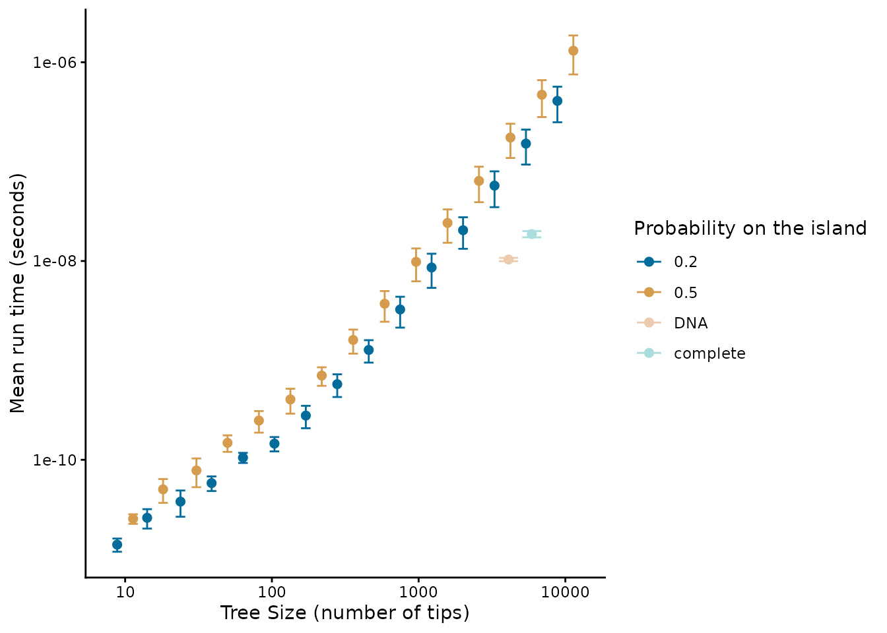
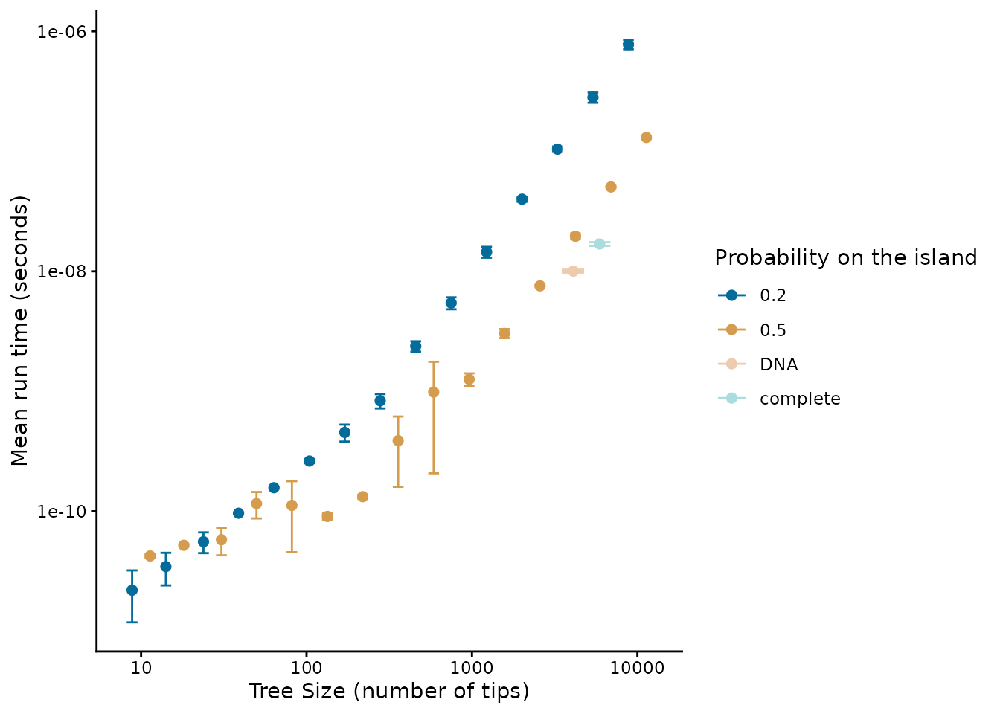
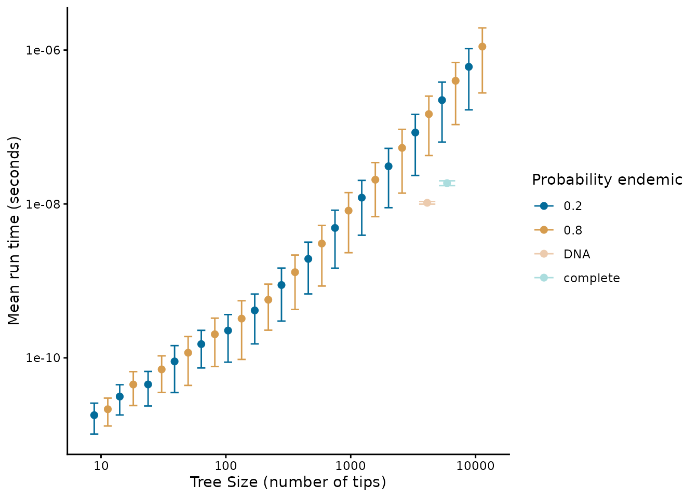

# Performance

``` r

library(DAISIEprep)
```

### Performance analysis of DAISIEprep::extract_island_species()

In this article we test and analyse the performance, in terms of time
consumption/complexity of the main function in the `DAISIEprep` R
package:
[`extract_island_species()`](https://joshwlambert.github.io/DAISIEprep/reference/extract_island_species.md).
This function takes in a phylogenetic tree and species endemicity data
in the form of a `phylo4d` object (an S4 class from the R package
`phylobase`).

This is not a thorough examination of all possible uses of the
[`extract_island_species()`](https://joshwlambert.github.io/DAISIEprep/reference/extract_island_species.md)
function, but rather gives an indication of the usability of the
function for data sets of different sizes, as well as detecting any
features of the data that may slow the process of extracting and
formatting the island community data.

All of the work for the performance analysis is carried out by the
[`benchmark()`](https://joshwlambert.github.io/DAISIEprep/reference/benchmark.md)
function from the `DAISIEprep` package. But before calling this function
we explain how the benchmarking is set up.

The first argument of
[`benchmark()`](https://joshwlambert.github.io/DAISIEprep/reference/benchmark.md)
is `phylod`. If this is `NULL` then the function will simulate the
phylogenies and the endemicity data given the: `tree_size_range`,
`num_points`, `prob_on_island`, and `prob_endemic` arguments. These
specify the lower and upper range of the tree size to simulate (the
sequence breaks can be in linear or log space depending on the argument
`log_scale`), the number of breaks in the sequence between lower and
upper tree sizes, the probability that a species will be on the island,
and if a species is on the island whether it is endemic (1 -
`prob_endemic` is the probability a species on the island is
non-endemic). If a `phylo4d` object is supplied to the `phylod` argument
in
[`benchmark()`](https://joshwlambert.github.io/DAISIEprep/reference/benchmark.md)
then this tree will be used to perform the benchmarking.

In the case of simulating data the parameter space of the performance
analysis is then the combination of these variables (using the
[`expand.grid()`](https://rdrr.io/r/base/expand.grid.html) function).
The phylogeny is simulated to a fixed size using the
[`rphylo()`](https://rdrr.io/pkg/ape/man/rlineage.html) function from
the `ape` package.

As we are stochastically simulating the endemicity statuses of the
species in the tree it may be that there is not an outgroup species not
on the island in order to correctly extract the colonisation times from
the stem age of the species or clade on the island. Therefore, we add an
outgroup which we ensure is not present on the island.

When we want to test the performance of the
[`extract_island_species()`](https://joshwlambert.github.io/DAISIEprep/reference/extract_island_species.md)
function using the `asr` algorithm we need to first run an ancestral
state reconstruction. This can easily be achieved if the `phylod` data
with the phylogeny and endemicity statuses at each tip of the tree are
ready (see tutorial vignette for more information on the `asr`
algorithm).

To quantify the time elapsed while the function runs there are several
methods in both base R and in various R packages (e.g. `microbenchmark`
or `rbenchmark`). However here we use
[`system.time()`](https://rdrr.io/r/base/system.time.html) from base R
(see
<https://radfordneal.wordpress.com/2014/02/02/inaccurate-results-from-microbenchmark/>)
for reasoning).

Side note: by default
[`DAISIEprep::benchmark()`](https://joshwlambert.github.io/DAISIEprep/reference/benchmark.md)
conditions on each simulated data set having a non-empty island, and
thus the function is not tested for the trivial case that no species
need to be extracted.

Due to the computational time not being deterministic and to ensure the
results are not spurious we replicate timing three times and the mean
“real time elapsed” is calculated, as well as replicating the simulation
(given by argument `replicates`) to account for stochasticity in the
simulation of the data.

The range of tree sizes we use encompasses those of common empirical
phylogenies (10 tips to 10,000 tips). We then generate a random sample
of tip states for each species, with the possible states being: endemic
to the island, non-endemic and not present on the island. We tested a
low probability of each species in the tree being on the island
($`P(0.2)`$) and a high probability of species being on the island
($`P(0.5)`$). For each of these scenarios we tested a low ($`P_E(0.2)`$,
$`P_{NE}(0.8)`$) and high probability ($`P_E(0.8)`$, $`P_{NE}(0.2)`$) of
island species being endemic to test whether this affects performance.
For each scenario we ran ten replicates. For isolated islands where
cladogenesis is high, island species will likely not be spread across
uniformly across the phylogeny as we assumed in our simulations, but
instead will be clustered. To check for scenarios where the number of
species per colonisation events is high (i.e.  radiations on the island)
we used the mammals of Madagascar data set. For this we used the (Upham
et al. 2019) complete and DNA-only phylogenies, and the island
endemicity data of Madagascar (Michielsen et al. 2023).

The results presented in this vignette are not computed each time the
vignette is rendered due to the large computation time required.
Instead, the analyses are run on a cluster computer and saved in the
package. The analysis script run to produce the results can be found in
the [DAISIEprepExtra](https://github.com/joshwlambert/DAISIEprepExtra)
package
[here](https://github.com/joshwlambert/DAISIEprepExtra/tree/main/inst/scripts).
The performance analysis uses the
[`benchmark()`](https://joshwlambert.github.io/DAISIEprep/reference/benchmark.md)
function in the `DAISIEprep` package.

The output produces results for the DNA-only phylogeny and the complete
phylogeny. The raw data of parameter estimates for the different
parameter settings is tidied into a tibble containing the data we need
for both the DNA and complete phylogeny.

``` r

# Internal function - Not to be called for regular 'DAISIEprep' operation,
# but merely to load in data
performance_data <- DAISIEprep:::read_performance()
```

We can plot the time consumption of each simulated and empirical
(DNA-only and complete phylogeny) data set and group the results by the
probability of species being on the island (`prob_on_island`). Now the
results can be plotted with `plot_performance` implemented in
`DAISIEprep`. This function follows the tidyverse convention of giving
variable names as variables (as opposed to strings) and uses tidy
evaluation to group by the variable given, either `prob_on_island` or
`prob_endemic`. First for the `min` algorithm:

``` r

plot_performance(
  performance_data = performance_data$performance_data_min,
  group_by = prob_on_island
)
#> Warning: `position_dodge()` requires non-overlapping x intervals.
#> `position_dodge()` requires non-overlapping x intervals.
```



And secondly for the `asr` algorithm:

``` r

plot_performance(
  performance_data = performance_data$performance_data_asr,
  group_by = prob_on_island
)
#> Warning: `position_dodge()` requires non-overlapping x intervals.
#> `position_dodge()` requires non-overlapping x intervals.
```



Alternatively, the data can be grouped by the probability that species
on the island are endemic (`prob_endemic`) for the `min` (first) and
`asr` (second) algorithms:

``` r

plot_performance(
  performance_data = performance_data$performance_data_min,
  group_by = prob_endemic
)
#> Warning: `position_dodge()` requires non-overlapping x intervals.
#> `position_dodge()` requires non-overlapping x intervals.
```


``` r

plot_performance(
  performance_data = performance_data$performance_data_min,
  group_by = prob_endemic
)
#> Warning: `position_dodge()` requires non-overlapping x intervals.
#> `position_dodge()` requires non-overlapping x intervals.
```



We find that even for large trees (10,000 tips) the scale of extraction
less than seconds, whereas running the DAISIE inference model is on the
scale of minutes to days, and thus pre-processing does not present a
bottleneck to the pipeline. The empirical trees we ran (the Madagascar
mammal example) were quicker to process than trees simulated with
uniformly random island presence (figure 1). This suggests that when the
ratio of species to colonisation events on the island is higher it
should be faster to extract. However, even for large trees with many
colonisations extraction should pose a computational problem. The speed
of extraction facilitates extraction of island data across many
phylogenies, for example extracting island community data across the
posterior distribution of inferred phylogenetic trees to account for
uncertainty in branching times and tree topology.

Given the approximately linear relationship between the size of the
phylogeny and time required for extraction in the above log-log plots we
fit a power law to the mean run time (mean across the replicates).

``` r

grouped_performance_data <- dplyr::group_by(
  performance_data$performance_data_min,
  tree_size,
  "prob_on_island"
)

mean_performance_data <- dplyr::summarise(
  grouped_performance_data,
  mean = mean(median_time),
  .groups = "drop"
)

fit_min <- lm(log(mean_performance_data$mean) ~ log(mean_performance_data$tree_size))
fit_min$coefficients
#>                          (Intercept) log(mean_performance_data$tree_size) 
#>                           -28.297771                             1.399895

grouped_performance_data <- dplyr::group_by(
  performance_data$performance_data_asr,
  tree_size,
  "prob_on_island"
)

mean_performance_data <- dplyr::summarise(
  grouped_performance_data,
  mean = mean(median_time),
  .groups = "drop"
)

fit_asr <- lm(log(mean_performance_data$mean) ~ log(mean_performance_data$tree_size))
fit_asr$coefficients
#>                          (Intercept) log(mean_performance_data$tree_size) 
#>                             -28.0177                               1.3008
```

The growth in time for both the `min` and `asr` algorithms follows a
power function ($`y=ax^k`$) with exponents $`k =`$ 1.3998949 and $`k =`$
1.3008005, respectively, when fitted on mean run time against tree size.
Therefore the time complexity scales relatively well with tree size, and
thus unless needing to be applied to extremely large phylogenies
(\>10,000 tips) the `DAISIEprep` extraction functionality should be
applicable.

## References

Michielsen, N. M., S. M. Goodman, V. Soarimalala, A. A. E. van der Geer,
L. M. Dávalos, G. I. Saville, N. Upham, and L. Valente. 2023. [The
macroevolutionary impact of recent and imminent mammal extinctions on
madagascar](https://doi.org/10.1038/s41467-022-35215-3). Nature
Communications 14. Springer Science; Business Media LLC.

Upham, N. S., J. A. Esselstyn, and W. Jetz. 2019. [Inferring the mammal
tree: Species-level sets of phylogenies for questions in ecology,
evolution, and
conservation](https://doi.org/10.1371/journal.pbio.3000494). PLOS
Biology 17:e3000494. Public Library of Science (PLoS).
